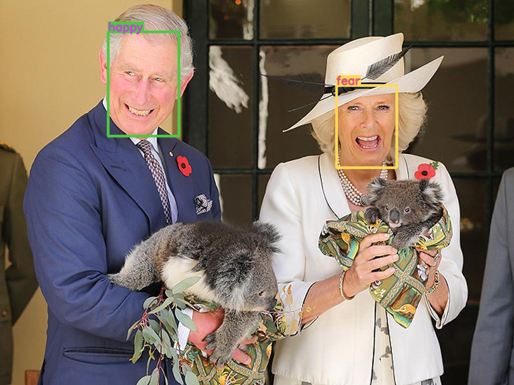
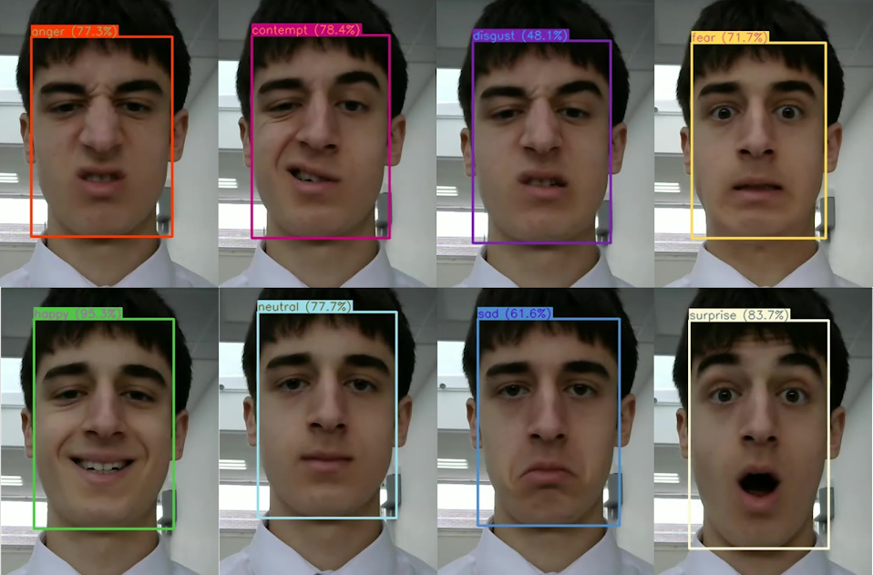

# Emotion Detection Using Yolo-V5 and RepVGG
This repository uses [Yolo-V5](https://github.com/ultralytics/yolov5) and [RepVGG](https://github.com/DingXiaoH/RepVGG) to detect facial expressions and classify emotions (see the [architecture](#Architecture) for more info on how it works). To see how to use the code, check out the [usage](#usage) section for more information.
## Example
This is an example of emotion classification:

This is a picture of me pulling all 8 of the facial expressions that the model classifies:
<br>
## Setup
### pip
`pip install -r requirements.txt`
### conda
`conda env create -f env.yaml`
## Emotions
This model detects 8 basic facial expressions:
- anger
- contempt
- disgust
- fear
- happy
- neutral
- sad
- surprise<br>
and then attempts to assign them appropriate colours. It classifies every face, even if it is not that confident about the result!
## Usage
```
usage: main.py [-h] [--source SOURCE] [--img-size IMG_SIZE] [--conf-thres CONF_THRES] [--iou-thres IOU_THRES]
               [--device DEVICE] [--hide-img] [--output-path OUTPUT_PATH | --no-save] [--agnostic-nms] [--augment]
               [--line-thickness LINE_THICKNESS] [--hide-conf] [--show-fps]

optional arguments:
  -h, --help            show this help message and exit
  --source SOURCE       source
  --img-size IMG_SIZE   inference size (pixels)
  --conf-thres CONF_THRES
                        face confidence threshold
  --iou-thres IOU_THRES
                        IOU threshold for NMS
  --device DEVICE       cuda device, i.e. 0 or 0,1,2,3 or cpu
  --hide-img            hide results
  --output-path OUTPUT_PATH
                        save location
  --no-save             do not save images/videos
  --agnostic-nms        class-agnostic NMS
  --augment             augmented inference
  --line-thickness LINE_THICKNESS
                        bounding box thickness (pixels)
  --hide-conf           hide confidences
  --show-fps            print fps to console
```
## Architecture
There are two parts to this code: facial detection and emotion classification.
### Face Detection
This repository is a fork of [ultralytics/Yolo-V5](https://github.com/ultralytics/yolov5) however, now Yolo-v7 is used for faster detection! Read [here](https://ultralytics.com/yolov5) for more information on Yolo-V5 (original model). To detect faces, the model was trained on the [WIDER FACE](http://shuoyang1213.me/WIDERFACE/) dataset which has 393,703 faces. For more information, check out the paper [here](https://arxiv.org/pdf/1511.06523.pdf).
### Facial Expression Classification
This repository uses code directly from the [DingXiaoH/RepVGG](https://github.com/DingXiaoH/RepVGG) repository. You can read the RepVGG paper [here](https://arxiv.org/pdf/2101.03697.pdf) to find out more. Even though this is the main model, it made more sense to fork the Yolo-V5 repository because it was more complicated. The model was trained on the [AffectNet dataset](http://mohammadmahoor.com/affectnet/), which has 420,299 facial expressions. For more information, you can read the paper [here](http://mohammadmahoor.com/wp-content/uploads/2017/08/AffectNet_oneColumn-2.pdf).
